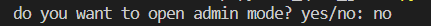
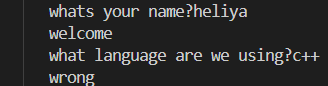
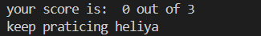

# Python Quiz Game

A simple quiz game built with Python
## Table of contents
  
- [Features](#features)  
- [Project Structure](#project-structure)  
- [Requirements](#requirements)
- [Installation](#installarion)
- [Environment Setup](#environment-setup)
- [Usage](#usage)
- [Roadmap](#roadmap)
- [Screen shot](#screen-shot)
- [Contributing](#contributing)
- [License](#license)
- [Author](#author)

## Features
-   Quiz System

    - Ask the player multiple questions
    - Checks the answer automatically
    - Calculate the final score
- Result storage
    - Saves quiz results in `result.txt`
- Includes an admin mode 
    - Asks for the admin password 
    - Checks if the password is correct
    - Keeps the private information outside the main python file
    - loads the password from `.env`

    


## Project Structure
```text
python_quiz_game/
│   .env.example
│   main.py
│   question.py
│   README.md
│   requirements.txt
├───gifts
│       quiz_demo.gif
├───pictures
│       1.png
│       2.png
│       3.png
└───
```
### File Description 
| File | Description | 
| --- | --- | 
| ` main.py ` | main file used to run quiz game |
| `  question.py ` | stores questions and answers |
| `requirements.txt` | lists the python packages needed for the project. |
| `.env.example ` | shows the environment variables needed by the project |
| `.gitignore ` | tells git which files and folders should not be tracked |
| `.README.md ` | contains the project documentation |
| `pictures/ ` | stores project screenshots |   
| `pictures/1.png ` | screenshot of the game start |
| `pictures/2.png ` | screenshot of the quiz section |
| `pictures/3.png ` | screenshot of the final result |
| `gifs/ ` | stores demo GIF files |
| `gifs/quiz_demo.gif ` | shows the project demo |

## Requirements
before running the project, make sure you have:
- `python 3`
- `python-dotenv`
## Installation
1. Open a terminal in the project folder.
2. check that python is installed :
```bash
python--version
```
3. Install the python packages:
```bash
pip install -r requirements.txt

```
## Environment Setup
1. create a `.env` file from `.env.example`:
```bash
cp .env.example .env
```
2. Open the new `.env` file
3. Replace the example value  with your own password
```text
QUIZ_ADMIN_PASSWORD=your_password_here
```
4. save the file.
> do not commit your `.env` file becuase it may contain private information

## Usage
1.  Open a terminal in the project folder
2. Run the quiz game
```bash
python main.py
```
3. Choose `yes` or `no` for admin mode
4. If you choose `yes` enter a password from your `.env` file
5. Enter your name
6. Answer the questiona
7. See your final score and message
8. Your result is saved in `result.txt`
## Example Output
```text
do you want to open admin mode? yes/no: no
whats your name?maria
welcome
what language are we using?python 
correct
what comand start a git?git init
correct
what comand shows git status?git status
correct
your score is:  3 out of 3
excelient job maria
```
## Screen shot
### Start game

### Quiz

### Final score

## Demo

## Roadmap
- [x] add multiple quiz questions
- [x] calculate the final score
- [ ] add admin mode
- [ ] save results to a file
- [ ] add multiple quiz questions
- [ ] add more quiz questions
- [ ] add difficulty levels
- [ ] add a timer
## Contributing

## License

## Author
create by [helia](https://github.com/heliya-babaie-sh)